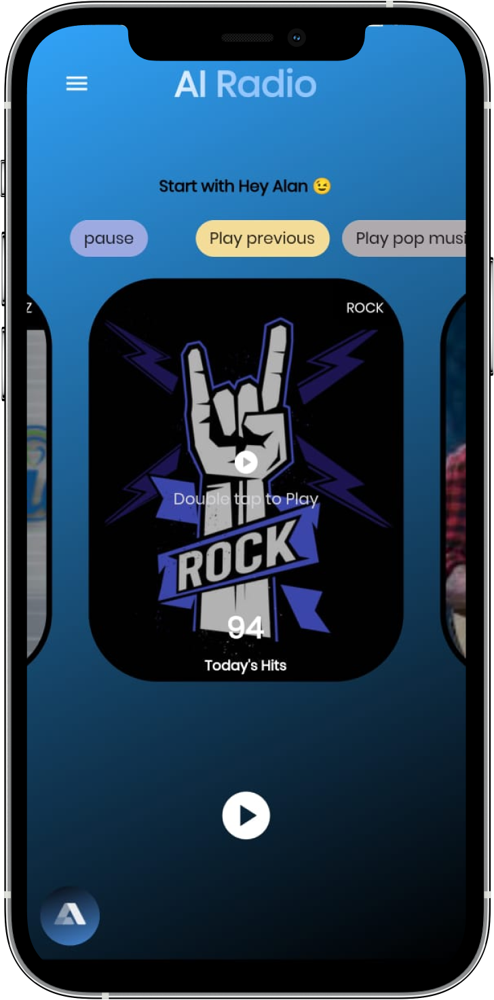

# AI_Radio

A new Flutter one day project built on Alan AI, I challenged myself to build it in a day, cause I felt Alan AI exciting.
This is just a inspired project from the CodePur.

## Preview

    

## 

## Found this project useful?

If you found this project useful, then please consider giving it a :star: on Github and sharing it with your friends via social media.

## ✍🏽 Author: NSVEGUR